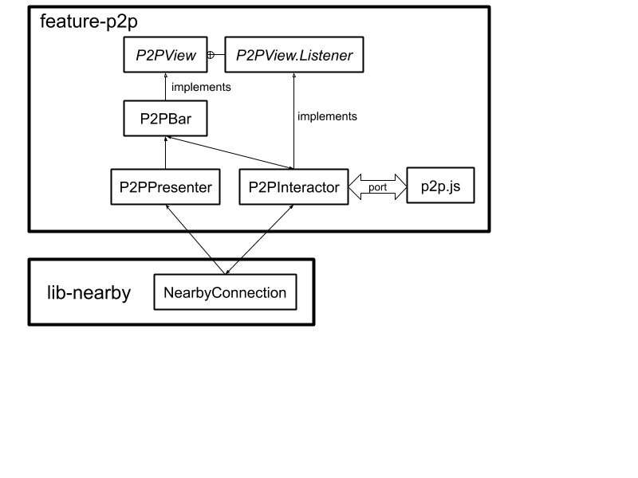

# [Android Components](../../../README.md) > Feature > P2P

A feature that enables sharing of URLs and web pages through peer-to-peer wifi
connections. It uses the [`freeze-dry`](https://github.com/WebMemex/freeze-dry) library within a
web extension to
create an HTML document that encodes a web page and all external resources it relies on
(such as images and stylesheets) as a single file.

## Usage

### Setting up the dependency

Use Gradle to download the library from [maven.mozilla.org](https://maven.mozilla.org/) ([Setup repository](../../../README.md#maven-repository)):

```Groovy
implementation "org.mozilla.components:feature-p2p:{latest-version}"
```

### Sample usage

The P2P toolbar has been integrated into [`samples/browser`](../../../samples/browser). Key files are:

* [`BrowserFragment`](../../../samples/browser/src/main/java/org/mozilla/samples/browser/BrowserFragment.kt),
which instantiates `P2PIntegration` and supports permission granting.
* [`P2PIntegration`](../../../samples/browser/src/main/java/org/mozilla/samples/browser/integration/P2PIntegration.kt),
which instantiates `P2PFeature` and contains code to launch and close the toolbar.
* [`DefaultComponents`](../../../samples/browser/src/main/java/org/mozilla/samples/browser/DefaultComponents.kt), which lazily provides a 
[NearbyConnection](../../components/lib/nearby/src/main/java/mozilla/components/lib/nearby/NearbyConnection.kt) and adds the toolbar to the settings menu.
* [`fragment_browser.xml`](../../../samples/browser/src/main/res/layout/fragment_browser.xml), which includes the `P2PBar` widget.

## Structure

The structure of the feature is shown in this block diagram:



The four boxes on the left represent Kotlin classes.
The class `P2PFeature` launches `P2PController`, which controls the view `P2PBar` and is the sole
point of communication with the class `NearbyConnection` in [`lib-nearby`](../../lib/nearby/README.md).
When a request is made to send a web page, `P2PController` sends a 
[`Port`](https://developer.mozilla.org/en-US/docs/Mozilla/Add-ons/WebExtensions/API/runtime/Port) 
message to the web extension `p2p.js` requesting that HTML for the page. This extension consists of 
a small amount of original code (`p2p-base.js`), [`freeze-dry`](https://github.com/WebMemex/freeze-dry), and
the libraries on which it depends. These Javascript files are combined into a single file `p2p.js` by
[`Browserify`](http://browserify.org/). Once the page has been "freeze-dried", it is sent as a `Port` message
from the web extension to `P2PController`.

## Building the web extension

While the extension is included in this repository,
here is how to re-build it:

```
# Install browserify to compress freeze-dry's dependencies into a single file.
$ npm install browserify

# Navigate to the extension code directory.
$ cd components/feature/p2p/src/main/assets/extensions/p2p/

# Install the freeze-dry tool to package up a web page.
$ npm install freeze-dry

# Combine p2p-base.js, freeze-dry.js, and the latter's dependencies into a single file.
$ browserify p2p-base.js -o p2p.js
```

## Licenses of included code

The file `p2p.js` includes source code that did not originate with `android-components`. 
Here are the libraries and their respective licenses.

* [`ansi-styles`](https://www.npmjs.com/package/ansi-styles): [MIT](https://opensource.org/licenses/MIT)
* [`babel-runtime`](https://www.npmjs.com/package/babel-runtime): [MIT](https://opensource.org/licenses/MIT)
* [`blob`](https://www.npmjs.com/package/blob): [MIT](https://opensource.org/licenses/MIT)
* [`blob-util`](https://www.npmjs.com/package/blob-util): [Apache-2.0](https://www.apache.org/licenses/LICENSE-2.0)
* [`chalk`](https://www.npmjs.com/package/chalk): [MIT](https://opensource.org/licenses/MIT)
* [`color-convert`](https://www.npmjs.com/package/color-convert): [MIT](https://opensource.org/licenses/MIT)
* [`color-name`](https://www.npmjs.com/package/color-name): [MIT](https://opensource.org/licenses/MIT)
* [`core-js`](https://www.npmjs.com/package/core-js): [MIT](https://opensource.org/licenses/MIT)
* [`doctype-to-string`](https://www.npmjs.com/package/doctype-to-string): [CC0-1.0](https://creativecommons.org/publicdomain/zero/1.0/)
* [`document-outerhtml`](https://www.npmjs.com/package/document-outerhtml): [CC0-1.0](https://creativecommons.org/publicdomain/zero/1.0/)
* [`domnode-at-path`](https://www.npmjs.com/package/domnode-at-path): [MIT](https://opensource.org/licenses/MIT)
* [`escape-string-regexp`](https://www.npmjs.com/package/escape-string-regexp): [MIT](https://opensource.org/licenses/MIT)
* [`flatten`](https://www.npmjs.com/package/flatten): [MIT](https://opensource.org/licenses/MIT)
* [`freeze-dry`](https://www.npmjs.com/package/freeze-dry): [Unlicense](https://unlicense.org/)
* [`has-flag`](https://www.npmjs.com/package/has-flag): [MIT](https://opensource.org/licenses/MIT)
* [`immediate`](https://www.npmjs.com/package/immediate): [MIT](https://opensource.org/licenses/MIT)
* [`indexes-of`](https://www.npmjs.com/package/indexes-of): [MIT](https://opensource.org/licenses/MIT)
* [`lie`](https://www.npmjs.com/package/lie): [MIT](https://opensource.org/licenses/MIT)
* [`memoize-one`](https://www.npmjs.com/package/memoize-one): [MIT](https://opensource.org/licenses/MIT)
* [`memoize-weak`](https://www.npmjs.com/package/memoize-weak): [ISC](https://opensource.org/licenses/ISC)
* [`mutable-proxy`](https://www.npmjs.com/package/mutable-proxy): [MIT](https://opensource.org/licenses/MIT)
* [`native-or-lie`](https://www.npmjs.com/package/native-or-lie): [Apache-2.0](https://www.apache.org/licenses/LICENSE-2.0)
* [`path-to-domnode`](https://www.npmjs.com/package/path-to-domnode): [MIT](https://opensource.org/licenses/MIT)
* [`postcss`](https://www.npmjs.com/package/postcss): [MIT](https://opensource.org/licenses/MIT)
* [`postcss-values-parser`](https://www.npmjs.com/package/postcss-values-parser): [MPL-2.0](http://mozilla.org/MPL/2.0/)
* [`regenerator-runtime`](https://www.npmjs.com/package/regenerator-runtime): [MIT](https://opensource.org/licenses/MIT)
* [`source-map`](https://www.npmjs.com/package/source-map): [BSD-3-Clause](https://opensource.org/licenses/BSD-3-Clause)
* [`supports-color`](https://www.npmjs.com/package/supports-color): [MIT](https://opensource.org/licenses/MIT)
* [`when-all-settled`](https://www.npmjs.com/package/when-all-settled): [Unlicense](https://unlicense.org/)


## License

    This Source Code Form is subject to the terms of the Mozilla Public
    License, v. 2.0. If a copy of the MPL was not distributed with this
    file, You can obtain one at http://mozilla.org/MPL/2.0/
